# 🛡️ Proteção, Afeto e Diálogo
### *O direito de crescer em segurança — Guia de Educação Sexual Preventiva*

<p align="center">
  
  
  
  
  
</p>

---

## 📖 Visão Geral

O **Proteção, Afeto e Diálogo** é uma **cartilha virtual e plataforma web interativa** concebida para apoiar pais, mães, responsáveis, educadores e profissionais da rede de proteção na tarefa vital de dialogar com crianças e adolescentes sobre corpo, limites, sentimentos e autoproteção.

Fruto de pesquisa aplicada no território da Zona Oeste do Rio de Janeiro, o projeto traduz conceitos pedagógicos e científicos em uma experiência digital acolhedora, sensível e livre de tabus, transformando a informação de qualidade em um verdadeiro escudo de defesa contra violências e abusos sexuais infantojuvenis.

> ❝ *Educação sexual preventiva **NÃO** é sobre o ato sexual. É sobre sexualidade, saúde, respeito, limites e autoproteção.* ❞

---

## 🌟 Principais Recursos e Experiência Interativa

A aplicação une rigor pedagógico a uma interface moderna (*glassmorphism*, microinterações e design responsivo), proporcionando uma leitura dinâmica e participativa:

### 🧩 1. Conhecendo o Corpo ("Nomear para Proteger")
- **Ilustração Anatômica Interativa (`BodyGame`):** Mapa visual lúdico onde o usuário interage com pontos-chave do corpo para compreender o conceito de áreas privadas e autonomia corporal.
- **Linguagem Direta e Acolhedora:** Incentivo ao uso dos nomes corretos das partes íntimas, eliminando apelidos que dificultam revelações ou pedidos de socorro.

### 🚦 2. O Semáforo do Consentimento
- **Sinal Verde (Toque Seguro):** Demonstrações espontâneas e voluntárias de afeto, respeito e procedimentos médicos com responsáveis presentes.
- **Sinal Amarelo (Atenção aos Limites):** Ações que geram desconforto (abraços forçados, cócegas excessivas, invasões de privacidade).
- **Sinal Vermelho (Toque Inseguro / Perigo):** Toques não permitidos, chantagens de segredo ("nosso segredinho"), pedidos de fotos ou toques em partes íntimas.

### 🔍 3. Sinais de Alerta em Abas Dinâmicas
- Classificação clara de sinais de atenção observáveis no dia a dia:
  - **Físicos:** Marcas corporais atípicas, queixas recorrentes, alterações ginecológicas/urológicas.
  - **Cognitivos:** Quedas abruptas de rendimento, perda de concentração, refúgio no ambiente escolar.
  - **Emocionais:** Medo generalizado, culpa desmedida, alterações drásticas de humor e comportamento.

### 🌐 4. Alerta Digital e Prevenção ao Grooming
- Orientações práticas sobre aliciamento online (*grooming*) em redes sociais e jogos virtuais.
- Boas práticas para navegação segura: privacidade de perfis, preservação de imagens familiares e respaldo da legislação brasileira.

### 🗺️ 5. Mapeamento de Canais de Apoio & Geolocalização
- **Modais com Mapas Interativos (Leaflet + Google Tiles):** Localização geográfica precisa dos equipamentos públicos de referência no território de Campo Grande (RJ).
- **Ações Rápidas:** Botões com um clique para traçar rotas no Google Maps, copiar telefones/endereços e realizar ligações de emergência instantâneas.
- **Botão Flutuante de Emergência (FAB):** Acesso prioritário permanente ao **Disque 100** e à **Polícia Militar (190)**.

---

## 🏛️ Estrutura Pedagógica dos Módulos

```mermaid
graph TD
    A["Cartilha Virtual: Proteção, Afeto e Diálogo"] --> B["Seção 1: Entenda"]
    A --> C["Seção 2: Guia Prático"]
    A --> D["Seção 3: Rede de Apoio"]
    A --> E["Seção 4: Canais & Atendimento"]

    B --> B1["Diferença: Sexo vs. Sexualidade"]
    B --> B2["O que É e o que NÃO É Prevenção"]
    B --> B3["Formas e Contextos de Abuso"]
    B --> B4["Mitos e Realidades (FlipCards)"]
    B --> B5["Pilares do Consentimento & Checklist"]

    C --> C1["Ilustração Interativa do Corpo"]
    C --> C2["Semáforo dos Toques"]
    C --> C3["Tabs de Sinais de Alerta"]
    C --> C4["Segurança Digital & Grooming"]

    D --> D1["Papel da Família na Prevenção"]
    D --> D2["Papel da Escola e Educadores"]
    D --> D3["Passo a Passo de Acolhimento"]
    D --> D4["Articulação Multiprofissional"]

    E --> E1["Emergência: Disque 100 e 190"]
    E --> E2["Conselho Tutelar de Campo Grande"]
    E --> E3["CRAS Cecília Meireles & Tomé"]
    E --> E4["CREAS Zilda Arns Neumann"]
    E --> E5["DPCA - Delegacia Especializada"]
```



---

## 🛠️ Stack Tecnológica

O projeto foi construído utilizando tecnologias modernas do ecossistema front-end:

| Tecnologia | Finalidade |
| :--- | :--- |
| **React 19** | Biblioteca declarativa para arquitetura baseada em componentes |
| **Vite 8** | Ambiente de desenvolvimento de alta performance e empacotamento otimizado |
| **Vanilla CSS Moderno** | Design system exclusivo com variáveis HSL, *glassmorphism* e tipografia customizada |
| **GSAP + ScrollTrigger** | Orquestração de animações, scroll-reveals, cartões 3D Tilt e efeitos de spotlight |
| **Leaflet & React-Leaflet** | Mapas interativos com geolocalização e marcadores personalizados |
| **Lucide React** | Conjunto elegante e consistente de ícones vetoriais |
| **Oxlint** | Linter de última geração focado em velocidade e qualidade de código |

---

## 📂 Estrutura de Diretórios

```text
Cartilha_v2/
├── public/                 # Favicons, ícones PWA e manifesto da aplicação
├── src/
│   ├── assets/             # Imagens da autora, logos de apoiadores e parceiros
│   ├── components/
│   │   ├── AcolhimentoCard/    # Cartão com etapas do protocolo de acolhimento
│   │   ├── AlertTabs/          # Abas dinâmicas de sinais físicos, cognitivos e emocionais
│   │   ├── BodyGame/           # Ilustração anatômica interativa de zonas privadas
│   │   ├── ChannelInfoCard/    # Card de canal com acionador de modal informativo
│   │   ├── ChecklistItem/      # Itens de checklist interativo de prevenção familiar
│   │   ├── ConceptModals/      # Modais conceituais (O que É / O que NÃO É)
│   │   ├── DigitalAlert/       # Módulo educativo sobre segurança cibernética
│   │   ├── EmergencyModals/    # Botão FAB e modal de acesso emergencial 24h
│   │   ├── FamilyRoleModals/   # Modais com benefícios da prevenção no seio familiar
│   │   ├── FlipCard/           # Cartões interativos 3D com efeito flip (Mitos e Fatos)
│   │   ├── Footer/             # Rodapé institucional com logos e créditos
│   │   ├── Hero/               # Seção de abertura com tipografia editorial e blobs dinâmicos
│   │   ├── InfoModal/          # Modal rico com contatos e mapa interativo Leaflet
│   │   ├── Navbar/             # Cabeçalho com navegação scrollspy e menu responsivo
│   │   ├── ProgressBar/        # Barra de progresso de leitura em tempo real
│   │   ├── SchoolRoleModals/   # Modais com o papel da escola e rede intersetorial
│   │   ├── Section1/           # Módulo 1: Conceituação e fundamentos da prevenção
│   │   ├── Section2/           # Módulo 2: Ferramentas práticas de proteção
│   │   ├── Section3/           # Módulo 3: Família, escola e acolhimento
│   │   ├── Section4/           # Módulo 4: Canais de apoio e créditos
│   │   ├── Semaphore/          # Componente interativo do semáforo do consentimento
│   │   ├── SpotCard/           # Cartão com cursor-follow spotlight glow
│   │   └── TiltCard/           # Cartão com rotação 3D responsiva ao movimento do mouse
│   ├── pages/
│   │   └── Home/               # Página principal unificada com animações orquestradas
│   ├── App.jsx                 # Componente raiz da aplicação
│   ├── index.css               # Folha de estilos central e design tokens
│   └── main.jsx                # Ponto de entrada da aplicação React
├── index.html              # Template base com fontes Fraunces e Plus Jakarta Sans
├── package.json            # Metadados e dependências do projeto
└── vite.config.js          # Configuração de build do Vite
```

---

## 🚀 Como Executar Localmente

### Pré-requisitos
- **Node.js** (versão 18.x ou superior recomendada)
- Gerenciador de pacotes **npm**, **yarn** ou **pnpm**

### Passo a passo

1. **Clone o repositório:**
   ```bash
   git clone https://github.com/AugustoBrunoo/cartilha_virtual.git
   cd cartilha_virtual
   ```

2. **Instale as dependências:**
   ```bash
   npm install
   ```

3. **Inicie o servidor de desenvolvimento:**
   ```bash
   npm run dev
   ```
   Acesse [http://localhost:5173](http://localhost:5173) no seu navegador.

4. **Comandos adicionais:**
   ```bash
   # Gerar o bundle de produção otimizado
   npm run build

   # Visualizar localmente o build de produção
   npm run preview

   # Executar checagem estática de código com Oxlint
   npm run lint
   ```

---

## 👥 Autoria & Créditos

### 👩‍🏫 Autora e Pesquisadora
- **Bruna Chagas**  
  *Graduanda em Pedagogia pela UniSão José e Master ESEPAS (Educação Sexual, Emocional e Prevenção ao Abuso Sexual).*  
  Pesquisadora do **Programa Jovens Cientistas Cariocas**, articulando ações educativas e de orientação preventiva voltadas a famílias, educadores e comunidades na Nave do Conhecimento de Campo Grande.

### 🏛️ Apoio Institucional
- **Nave do Conhecimento de Campo Grande**
- **Programa Jovens Cientistas Cariocas (CIEDS)**

### 💻 Desenvolvimento Tecnológico
- Desenvolvido com carinho e excelência técnica por [**Noda Soluções**](https://www.nodasolucoes.dev/).

---

## ⚖️ Nota de Responsabilidade (Disclaimer)

> Este Web App é um recurso educativo, preventivo e informativo, fruto de pesquisa científica e extensão comunitária. **Não substitui o atendimento técnico, psicológico, médico ou jurídico de órgãos oficiais de saúde, assistência social e segurança pública.** Em casos de emergência ou flagrante, acione imediatamente o **Disque 100** ou a **Polícia Militar (190)**.

